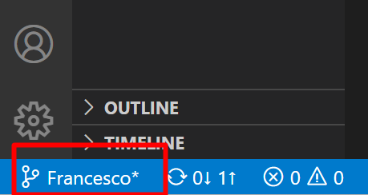

# Security Lecture
## Introduzione
Per clonare il progetto 
1. Premere Ctrl+maiusc+P e digitare Git: Clone
2. Inserire il link URL https://github.com/Fracomito/Security.git
3. Sceglere la cartella per il progetto e.g. C:\Users\NameUser\PROJECT\Security

## Cambio del branch
In VSCODE per evitare di sovrascrivere il software comune gia funzionante è meglio 
cambiare il branch principale (origin/main) con il proprio. Sarà sufficente cliccare
in baso a sinistra e selezionare il proprio branch.  

  

## Aggiornare il repository
Per aggiornare i dati sul proprio repository, lanciare i seguenti comandi sul terminale:
1. **git add .**, per aggiungere i file alla lista da caricare.
2. **git commit -m "Commento che descrive le modifiche"** per preparare e commentare il 
pacchetto da aggiornare.
3. **git push** per caricare il tutto sul repository.

